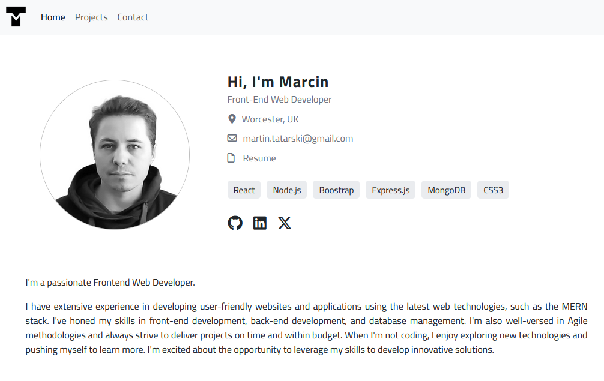

# Marcin Tatarski - React Portfolio

## Overview

Welcome to my React-based portfolio app! This is the latest version of my portfolio, where I showcase my skills and projects as a front-end web developer. With a focus on creating user-friendly applications using React and incorporating Bootstrap for a seamless experience, I'm excited to share my journey in web development with you.

## About Me

I'm a passionate Frontend Web Developer. 

I have extensive experience in developing user-friendly websites and applications using the latest web technologies, such as the MERN stack. I've honed my skills in front-end development, back-end development, and database management. I'm also well-versed in Agile methodologies and always strive to deliver projects on time and within budget.

My goal is to advance my career in front-end development, contributing to innovative projects and collaborating with like-minded professionals. I'm excited to connect with potential employers, clients, and fellow developers who share my enthusiasm for creating outstanding web experiences.

## Screenshot


*This is the main page of my portfolio, featuring a showcase of my most recent work, an 'About Me' section, and a way to get in touch with me.*

## Installation

To use the Readme Generator, follow these steps:

1. Ensure you have [Node.js](https://nodejs.org) installed.
2. Clone this repository to your local machine.

```sh
git clone https://github.com/martindocs-bootcamp/mtatarski-react-portfolio.git
```

3. Navigate to the project directory.

```sh
cd mtatarski-react-portfolio/portfolio
```

4. Install dependencies.

```sh
npm install
```

## Usage

To access and view my portfolio website, you can follow these simple steps:

1. Open a web browser.

2. Navigate to the following URL: https://martindocs-bootcamp.github.io/mtatarski-react-portfolio/

3. Explore the various sections, including `Projects` and `Contact`, to learn more about my skills and projects.

Feel free to reach out to me if you have any questions or if you'd like to discuss potential collaboration or job opportunities. Thank you for visiting my portfolio!

## Dependencies

The following Node.js packages are utilized in this project:

```sh
npm install popperjs/core@2.11.8 bootstrap@5.3.2 localforage@1.10.0 match-sorter@6.3.3 react@18.2.0 react-dom@18.2.0 react-router-dom@6.21.3 sort-by@1.2.0 sass@1.70.0

```

- **popperjs/core**: A library for positioning popovers and tooltips in web applications.
- **bootstrap**: A popular CSS framework that simplifies the design and styling of web pages.
- **localforage**: A library that provides a simple key/value store for storing data in web browsers, supporting various storage backends.
- **match-sorter**: A utility library for sorting and filtering lists based on user input.
- **react**: A JavaScript library for building user interfaces, particularly for creating reusable UI components.
- **react-dom**: The ReactDOM library, an entry point for working with the DOM in React applications.
- **react-router-dom**: A library for handling navigation and routing in React applications.
- **sort-by**: A utility library for sorting arrays of objects based on a specified key.
- **sass**: A popular CSS preprocessor that extends the capabilities of CSS with features like variables and nesting.

## Questions
If you have any questions, feel free to reach out to me via [GitHub](https://github.com/martindocs).

## License

Please refer to the [LICENSE](./LICENSE.md) file in this repository for details on how this project is licensed.
